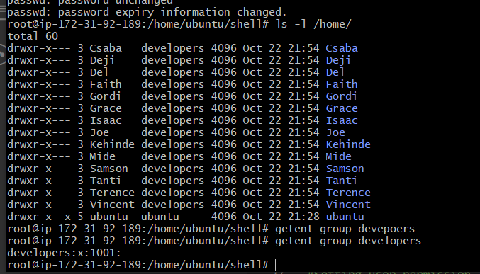
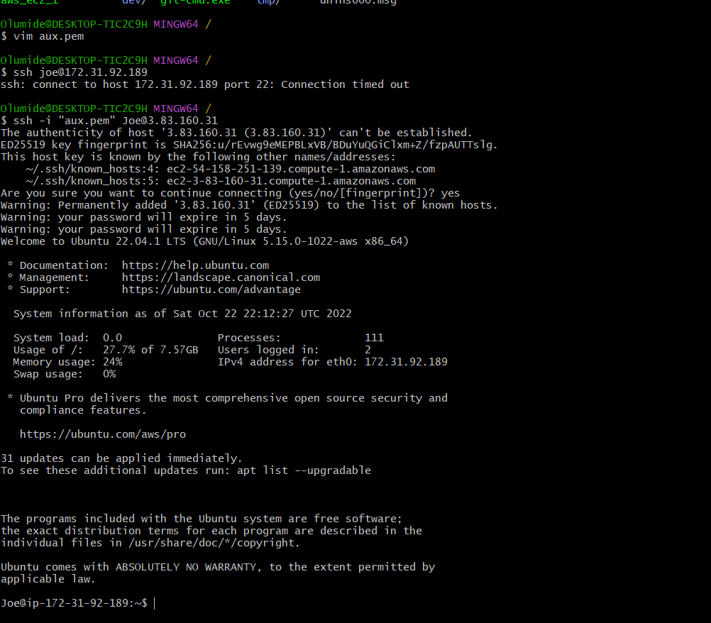

## AUX PROJECT DOCUMENTATION: SHELL SCRIPTING

### This task will onboard bulk Linux users onto a server. A shell script that reads csv which contains the names of the users is onboarded.

#

*used to list all file in the current directory. Basically to confirm onboard.sh is in the directory*

`ls -l`

*the command below copies the onboard.sh file from location machine to the destination server*

`scp -i "mide1_ec1.pem" onboard.sh ubuntun@1.1.1.1:~/:onboard.sh`

*check present working directory on the linux server and its content with below command respectively*

`pwd`

`ls`

*using th ls-l command to via details (permission) of files in the folder, mkdir to create a new directory/folder and mv command to move onboard.sh to the newly created directory. Subsequently confirm onboard.sh is in the expected directory (shell directory)*

`ls -l`

`mkdir shell`

`mv onboad.sh /home/ubuntu/shell`

*Navigate to the shell directory*

`cd shell`

*Using the touch command (in the shell directory), create files for the ssh private (id_rsa) and public (id_rsa.pub) key, also created a csv file with the names of users to onboard (names.csv). Used the list command to confirm that these files are present*

`touch id_rsa id_rsa.pub names.csv`

`ls`

*Using vim, pupulated the files with the private and public ket*

`vi id_rsa.pub`

`cat id_rsa.pub`

`vi id_rsa`

`cat id_rsa`

*using vim, added the names of the users to the csv file. The cat command displays the codes in the onboad.sh file which was already created in vim editor*

`vi names.csv`

`cat onboard.sh`

*New gorup is created for the dev team which is to be added with below command. Execute permission is given to the group and the script was run (need to switch to root user to run the script)*

`sudo groupadd developers`

`chmod +x developers`

`./onboard.sh`

*Output of script*

*list users that were created with the ls -l command and get look up user details in the group*

`ls -l`

`getent group developers`

*Testing with some newly created users to access the remote server via ssh*

`ssh -i "aux.pem"joe@172.31.92.189`

*confirmation that user was able to access remote server*

*User list all files which it has access (including hidden files)*

`ls -la`

*Thank you*